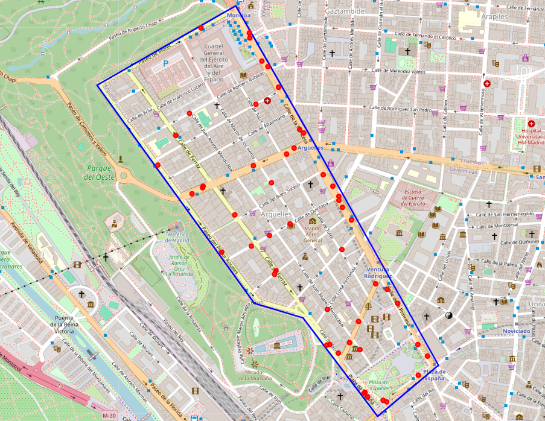

# TFM-Gemelo_Digital_de_Movilidad_Urbana

Código desarrollado para el Trabajo Fin de Máster **"Desarrollo de un gemelo digital de movilidad urbana basado en datos abiertos para la simulación y gestión del tráfico de vehículos de emergencia en Madrid"**.

El proyecto consiste en el desarrollo de un entorno de simulación de movilidad urbana basado en datos abiertos, utilizando información de tráfico del Ayuntamiento de Madrid y una red viaria obtenida a partir de OpenStreetMap. El objetivo principal es construir escenarios de simulación en SUMO que permitan analizar el comportamiento del tráfico urbano y estudiar estrategias orientadas a mejorar el desplazamiento de vehículos de emergencia.

El repositorio está organizado en distintas versiones independientes. Cada versión representa una fase de desarrollo del proyecto y puede ejecutarse por separado, sin necesidad de ejecutar las versiones anteriores. Esta organización permite consultar de forma progresiva la evolución del sistema, desde una simulación básica con tráfico aleatorio hasta una simulación avanzada con datos reales, vehículo de emergencia, rerouting dinámico y prioridad semafórica.

## Zona de estudio

La zona de estudio seleccionada para el desarrollo del proyecto corresponde al entorno de Argüelles, en Madrid. En la siguiente imagen se muestra el área delimitada junto con los sensores de tráfico utilizados durante el preprocesamiento de datos.

<p align="center">
  
</p>

## Estructura del repositorio

```text
TFM-Gemelo_Digital_de_Movilidad_Urbana/
│
├── Preprocesamiento_datos_trafico_Madrid.ipynb
│
├── version-1/
│   ├── configuraciones/
│   ├── mapas/
│   └── scripts/
│
├── version-2/
│   ├── configuraciones/
│   ├── datos_arguelles/
│   ├── mapas/
│   └── scripts/
│
├── version-3/
│   ├── configuraciones/
│   ├── datos_arguelles/
│   ├── mapas/
│   └── scripts/
│
├── version-4/
│   ├── configuraciones/
│   ├── datos_arguelles/
│   ├── mapas/
│   ├── resultados/
│   └── scripts/
│
├── requirements.txt
├── .gitignore
└── README.md
```

## Fase previa: preprocesamiento de datos

El notebook `Preprocesamiento_datos_trafico_Madrid.ipynb` se utiliza para estudiar y preparar los datos abiertos de tráfico antes de ejecutar las versiones de simulación.

En esta fase se realiza la lectura de los datos, la transformación de coordenadas, la delimitación de la zona de estudio y el filtrado de los sensores situados dentro del área seleccionada.

Este notebook no forma parte de una versión concreta, sino que se utiliza como fase previa para generar los ficheros de entrada necesarios para las versiones que trabajan con datos reales.


## Versiones del proyecto

### Versión 1: escenario base con tráfico aleatorio

La primera versión construye el escenario inicial de simulación en la zona de Argüelles. Para ello, se obtiene la red viaria, se convierte al formato utilizado por SUMO y se genera tráfico aleatorio.

Esta versión permite comprobar que la red se ha generado correctamente y que el entorno de simulación funciona antes de incorporar datos reales de tráfico.

### Versión 2: tráfico basado en datos abiertos

La segunda versión incorpora datos abiertos de tráfico del Ayuntamiento de Madrid. En esta fase se asocian los sensores reales con los tramos de la red de SUMO y se genera demanda de tráfico a partir de los valores de intensidad medidos por los sensores.

El objetivo de esta versión es pasar de un escenario con tráfico aleatorio a un escenario basado en datos reales.

### Versión 3: vehículo de emergencia y prioridad semafórica

La tercera versión introduce un vehículo de emergencia en la simulación y utiliza TraCI para actuar sobre los semáforos cercanos. Cuando el vehículo prioritario se aproxima a un cruce semaforizado, el sistema modifica temporalmente el estado del semáforo para facilitar su paso y posteriormente restaura el funcionamiento normal.

Esta versión permite validar una primera estrategia de prioridad semafórica para vehículos de emergencia.

### Versión 4: rerouting dinámico y prioridad semafórica adaptativa

La cuarta versión es la más avanzada del proyecto. En ella se incorpora la selección de origen y destino del vehículo de emergencia, el cálculo dinámico de rutas, el rerouting durante la simulación y una lógica mejorada de prioridad semafórica.

Esta versión permite comparar distintos escenarios y analizar si las estrategias aplicadas reducen el tiempo de desplazamiento del vehículo de emergencia.

## Requisitos

Para ejecutar el proyecto es necesario disponer de:

- Python 3.10 o superior.
- SUMO 1.25.0 o superior.
- Variable de entorno `SUMO_HOME` configurada.
- Librerías de Python incluidas en `requirements.txt`.
- Jupyter Notebook o JupyterLab para ejecutar el notebook de preprocesamiento.

En Windows, SUMO suele instalarse por defecto en una ruta similar a:

```text
C:\Program Files (x86)\Eclipse\Sumo
```

En ese caso, la variable de entorno `SUMO_HOME` debe apuntar a esa carpeta.

El notebook de preprocesamiento puede ejecutarse desde Anaconda Prompt, siempre que el entorno utilizado tenga instaladas las librerías necesarias.

## Instalación

Se recomienda crear un entorno virtual de Python antes de instalar las dependencias.

### Opción 1: entorno con venv

```bash
python -m venv .venv
```

Activar el entorno en Windows:

```bash
.venv\Scripts\activate
```

Activar el entorno en Linux o macOS:

```bash
source .venv/bin/activate
```

Instalar las dependencias:

```bash
pip install -r requirements.txt
```

### Opción 2: entorno con conda

```bash
conda create -n tfm-sumo python=3.11
conda activate tfm-sumo
pip install -r requirements.txt
```

## Configuración de SUMO

Para comprobar que SUMO está correctamente instalado, se puede ejecutar:

```bash
sumo --version
```

También se puede comprobar la instalación de SUMO-GUI con:

```bash
sumo-gui --version
```

Si Python no encuentra las librerías `traci` o `sumolib`, puede ser necesario añadir las herramientas de SUMO al `PYTHONPATH`.

En Windows, usando Anaconda Prompt o CMD:

```bash
set SUMO_HOME=C:\Program Files (x86)\Eclipse\Sumo
set PYTHONPATH=%SUMO_HOME%\tools;%PYTHONPATH%
```

En Linux o macOS:

```bash
export SUMO_HOME=/ruta/a/sumo
export PYTHONPATH=$SUMO_HOME/tools:$PYTHONPATH
```

## Ejecución del notebook de preprocesamiento

El notebook de preprocesamiento se encuentra en la raíz del repositorio:

```text
Preprocesamiento_datos_trafico_Madrid.ipynb
```

Para ejecutarlo es necesario tener instalado Jupyter Notebook o JupyterLab, además de las librerías indicadas en el fichero `requirements.txt`.

Una forma sencilla de abrirlo en Windows es utilizar Anaconda Prompt. Desde la carpeta raíz del repositorio, se puede ejecutar:

```bash
jupyter notebook
```

Después, en la ventana del navegador que se abre automáticamente, se selecciona el fichero:

```text
Preprocesamiento_datos_trafico_Madrid.ipynb
```

También puede abrirse con JupyterLab mediante:

```bash
jupyter lab
```

Si se utiliza un entorno de conda, es recomendable activarlo antes de abrir Jupyter. Por ejemplo:

```bash
conda activate tfm-sumo
jupyter notebook
```

El notebook realiza la lectura y preparación de los datos abiertos de tráfico, la transformación de coordenadas, la delimitación de la zona de estudio y el filtrado de sensores. Los ficheros generados posteriormente se utilizan como entrada en las versiones que trabajan con datos reales.

## Ejecución de las versiones

Cada versión puede ejecutarse de forma independiente desde su propia carpeta.

### Versión 1

```bash
cd version-1
python scripts/run_version-1.py
```

### Versión 2

```bash
cd version-2
python scripts/run_version-2.py
```

### Versión 3

```bash
cd version-3
python scripts/run_version-3.py
```

### Versión 4

```bash
cd version-4
python scripts/run_version-4.py
```

Los resultados de la versión 4 se almacenan en la siguiente ruta:

```text
version-4/resultados/
```

## Datos utilizados

El proyecto utiliza principalmente dos fuentes de información:

- Datos abiertos de tráfico del Ayuntamiento de Madrid, disponibles a través del fichero [pm.xml de informo](https://informo.madrid.es/informo/tmadrid/pm.xml).
- Red viaria obtenida a partir de OpenStreetMap.

Los datos de tráfico se utilizan para generar escenarios de simulación más próximos al comportamiento real de la zona de estudio. En concreto, la intensidad de tráfico se interpreta como vehículos por hora y se emplea para construir la demanda de vehículos dentro de SUMO.

## Notas importantes

- Las versiones del proyecto son independientes entre sí.
- No deben interpretarse como componentes conectados de una única aplicación final, sino como fases de desarrollo que permiten validar distintas funcionalidades.
- Algunas rutas internas pueden depender del sistema operativo y de la instalación local de SUMO.
- Los datos en tiempo real pueden variar en cada ejecución, por lo que los resultados de simulación no tienen por qué ser exactamente iguales entre distintas pruebas.
- Para usar TraCI, SUMO debe ejecutarse con un puerto remoto.
- La selección de origen y destino del vehículo de emergencia puede modificarse editando los edges correspondientes en los scripts de la versión 4.

## Autor

**Jorge Ortega Rodríguez**  
Máster Universitario en Ingeniería de Telecomunicación  
Escuela Técnica Superior de Ingenieros de Telecomunicación  
Universidad Politécnica de Madrid
